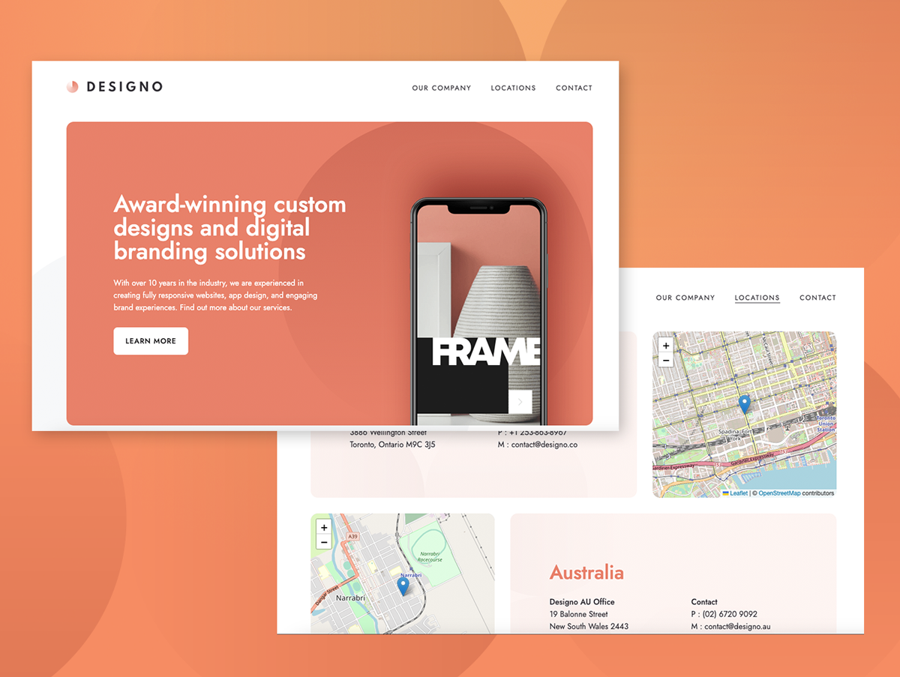
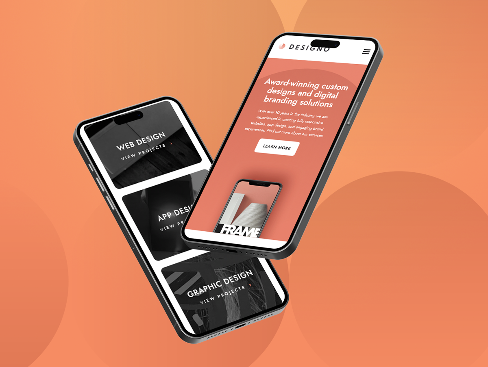

# Frontend Mentor - Designo agency website solution

This is a solution to the [Designo agency website challenge on Frontend Mentor](https://www.frontendmentor.io/challenges/designo-multipage-website-G48K6rfUT).

## Table of contents

- [Overview](#overview)
  - [The challenge](#the-challenge)
  - [Screenshot](#screenshot)
  - [Links](#links)
- [My process](#my-process)
  - [Built with](#built-with)
  - [What I learned](#what-i-learned)
  - [Continued development](#continued-development)
- [Author](#author)

## Overview

### The challenge

Users should be able to:

- View the optimal layout for each page depending on their device's screen size
- See hover states for all interactive elements throughout the site
- Receive an error message when the contact form is submitted if:
  - The `Name`, `Email Address` or `Your Message` fields are empty should show "Can't be empty"
  - The `Email Address` is not formatted correctly should show "Please use a valid email address"
- View actual locations on the locations page maps

### Screenshot




### Links

- Solution URL: [GitHub Repository](https://github.com/lorenacrincon/designo-website)
- Live Site URL: [Click Here](https://your-live-site-url.com)

## My process

### Built with

- Semantic HTML5 markup
- CSS custom properties
- Flexbox
- CSS Grid
- Mobile-first workflow
- [React](https://reactjs.org/) - JS library
- [Vite.js](https://vitejs.dev/)
- [TailwindCss](https://tailwindcss.com/) - For styles -[Sass](https://sass-lang.com/) - CSS pre-processor
- [Framer Motion](https://www.framer.com/motion/) - For animations
- [Formik](https://formik.org/) - Form validation
- [Leaflet JS](https://leafletjs.com/) - For interactive maps

### What I learned

```js
export const AnimationX = ({ children }) => {
  const ref = useRef(null);
  const isInView = useInView(ref, { once: true });

  return (
    <motion.div ref={ref} className="relative z-40">
      <span
        className="block -translate-x-1/2 opacity-0"
        style={{
          transform: isInView ? "none" : "translateX(-200px)",
          opacity: isInView ? 1 : 0,
          transition: "all 0.6s cubic-bezier(0.17, 0.55, 0.55, 1) 0.5s",
        }}
      >
        {children}
      </span>
    </motion.div>
  );
};
```

### Continued development

I would like to keep working on animation hooks.

## Author

- GitHub Profile - [Lorena Rincón](https://github.com/lorenacrincon)
- Frontend Mentor - [@lorenacrincon](https://www.frontendmentor.io/profile/lorenacrincon)
- Linkedin Profile - [Lorena Rincón](https://www.linkedin.com/in/lore-rincon)
